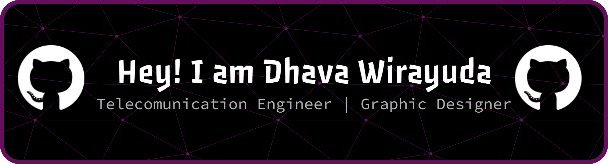
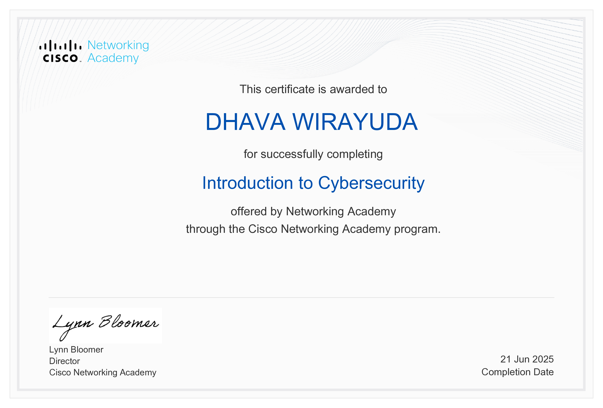
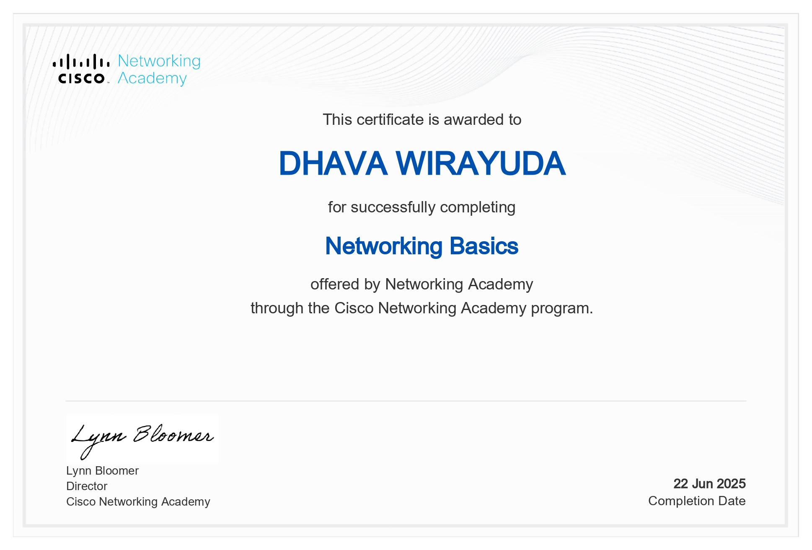

<p align="center">
  
</p>

## 🚀 About Me

I’m a **fresh graduate in Telecommunication Engineering** with a strong interest in **IT systems, IoT, cloud-based solutions, and digital automation**. I enjoy building things from scratch, breaking systems apart to understand how they work, and turning ideas into real, usable products.

I’m also the founder of **Spectrum.Byte**, a tech initiative focused on device repair, system optimization, and software recovery with a structured and professional approach.

---

## 🧠 What I’m Into

* 🌐 Internet of Things (IoT)
* ☁️ Cloud Computing & Automation
* 🤖 Artificial Intelligence (Computer Vision & NLP)
* 🔐 Cybersecurity Fundamentals
* 🧩 Full Stack Development

---

## 🔗 Tech Badges

<p align="center">
  
  
  
</p>

---

## 🛠 Tech Stack

<p align="center">
  
</p>

**Hardware & Embedded**

* ESP32, Sensors, IoT Devices
* Basic Networking & Telecommunication Systems

---

## 📌 Featured Projects

<table>
  <tr>
    <td width="50%">
      <h3>☁️ Cloud Portfolio App</h3>
      <p>Full‑stack web app with authentication, file upload/download, messaging, and PostgreSQL database.</p>
    </td>
    <td width="50%">
      <h3>🌐 IoT Monitoring System</h3>
      <p>ESP32‑based IoT system for sensor data acquisition, monitoring, and visualization.</p>
    </td>
  </tr>
  <tr>
    <td width="50%">
      <h3>🤖 Computer Vision</h3>
      <p>Image classification & segmentation using CNN (TensorFlow & OpenCV).</p>
    </td>
    <td width="50%">
      <h3>🔗 Web3 Experiments</h3>
      <p>Smart contract fundamentals and decentralized application experiments.</p>
    </td>
  </tr>
</table>

---

## 📊 GitHub Analytics

<p align="center">
  
  
</p>

<p align="center">
  
</p>

---

## 📜 Certifications & Achievements

<p align="center">
  
  
</p>

<p align="center">
  <b>Basic Cyber Security • Computer Network</b><br />
  <b>By Cisco</b><br />
  <i>Continuous learning through verified certifications.</i>
</p>

---

## 🧠 Current Focus Roadmap

```text
2026 Focus
│
├── IoT Systems
│   ├─ Advanced ESP32 Architectures
│   ├─ Sensor Fusion & LoRa Architectures
│
├── Cloud & DevOps
│   ├─ Docker & CI/CD
│   ├─ Cloud Deployment (AWS / GCP)
│
├── Artificial Intelligence
│   ├─ Computer Vision (Real‑time)
│   ├─ NLP‑based Assistants
│
└── Career
    ├─ Building Real‑world Products
    └─ Open Source Contribution
```

---

## 🌱 Currently Learning

* Advanced IoT System Design
* Cloud Infrastructure & Deployment
* AI‑powered Applications

---

## 📫 Let’s Connect

* 💼 LinkedIn: [dhavawirayudapy](https://linkedin.com/in/dhavawirayudapy)
* 🌐 Portfolio: [Dhava Wirayuda](https://dhavawirayuda.pages.dev/)
* ✉️ Email: [daffawirayuda128@gmail.com](mailto:daffawirayuda128@gmail.com)

---

<p align="center">
  <i>“Build with purpose. Learn endlessly. Share what you know.”</i> ✨
</p>
