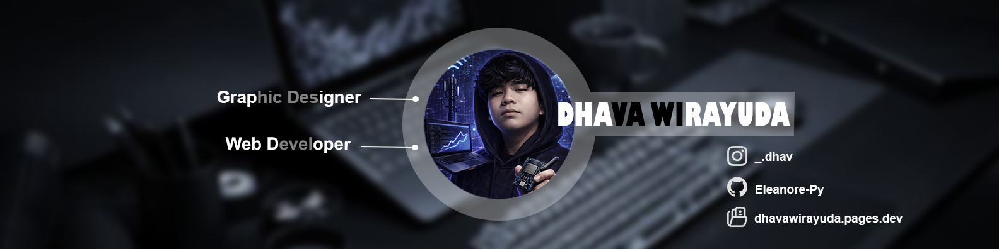

  

<h1 align="center">Hi, I'm Dhava 👋</h1>
<h3 align="center">Web Developer • Graphic Designer</h3>

  <i>Turning systems into solutions. Turning ideas into products.</i>

  

## 📊 GitHub Analytics

 

---

## 🎮 Lets Play With me

<picture>
  <source media="(prefers-color-scheme: dark)" srcset="https://raw.githubusercontent.com/Pavithran-P12/ReadmePacman/output/pacman-contribution-graph-dark.svg">
  <source media="(prefers-color-scheme: light)" srcset="https://raw.githubusercontent.com/Pavithran-P12/ReadmePacman/output/pacman-contribution-graph.svg">
  
</picture>

---

## 🚀 About Me

I'm a **fresh graduate in Telecommunication Engineering** with a deep passion for **IT systems, IoT, cloud infrastructure, and intelligent automation**.

- Building systems **from zero**
- Reverse-engineering tech to understand *why it works*
- Shipping **real, usable products**, not just demos

I’m also the founder of **Spectrum.Byte** — a tech initiative focused on  
**device repair, system optimization, data recovery, and software-based solutions**,  
built with a structured & professional mindset.

---

## 🧠 Tech Interests & Focus

- 🌐 Internet of Things & Embedded Systems  
- 🤖 Artificial Intelligence (Computer Vision & NLP)  
- 🔐 Cybersecurity Fundamentals   

---

## 🔗 interest

  
  
  
  

---

## 🛠 Tech Stack

### 💻 Software & Cloud

  

### 🔧 Hardware & Networking
- ESP32, LoRa, P2P Comunication Infrastructures  
- Moderate Networking & Telecommunication Systems  
- System Troubleshooting & Optimization  

---

## 📌 Featured Projects

<table>
  <tr>
    <td width="50%">
      <h3> Chatbot NLP base</h3>
      
word tokenizer with transformer and wikipedia dataset.

      <ul>
        <li>Transformer</li>
        <li>Wikipedia Engine</li>
        <li>Python</li>
      </ul>
    </td>
    <td width="50%">
      <h3>🌐 Wireless Sensor Netwwork</h3>
      
Transmiting sensor data via LoRa and send to server with ESP32.

      <ul>
        <li>LoRa Ebyte E220</li>
        <li>Pharsing data</li>
        <li>Web Server</li>
      </ul>
    </td>
  </tr>
</table>

---

## 📜 Certifications

  
  

  <b>Basic Cyber Security • Computer Networking</b> 
  <b>Cisco</b>

---

## 📫 Let’s Connect

  
  
  

  <i>Open for collaboration, product discussions, and early-stage tech opportunities.</i>

---
